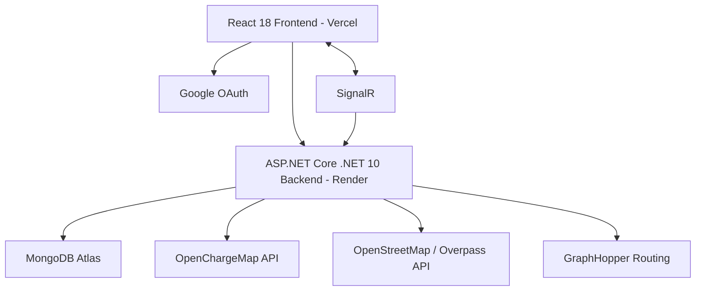

# ⚡ ChargeSaathi — EV Charging Station Locator & Social Travel Platform

ChargeSaathi is a full-stack Electric Vehicle (EV) charging station locator and collaborative travel platform designed to eliminate EV range anxiety. It empowers EV drivers to discover charging stations, explore nearby essential amenities, calculate optimized driving routes, and synchronize journeys in real-time with fellow travelers.

---

## 🌐 Live Demo

* **Live Production Website:** [https://ev-charge-station-sigma.vercel.app](https://ev-charge-station-sigma.vercel.app)
* **GitHub Repository:** [https://github.com/Charan-Dasari/EV_Charge_Station](https://github.com/Charan-Dasari/EV_Charge_Station)

---

## 📌 About the Project

ChargeSaathi addresses the critical challenge of EV adoption in India: **range anxiety and charging uncertainty**. By aggregating live station availability with surrounding point-of-interest (POI) infrastructure, ChargeSaathi enables drivers to plan charging stops around real-world necessities like meals, medical emergencies, and rest stops.

Additionally, ChargeSaathi introduces **Social Sync** — a real-time travel companion feature allowing two separate EV drivers to link their journeys via a one-time passcode (OTP), track each other's live location on the shared map, and communicate via real-time WebSockets.

---

## ✨ Key Features

* **⚡ EV Charging Station Discovery:** Real-time charging station mapping with bounding-box queries powered by the OpenChargeMap API.
* **🗺️ Interactive Map Experience:** High-performance Leaflet map with dynamic light/dark basemaps, smooth panning, and marker clustering for thousands of charging points.
* **🔍 Search & Geocoding:** Instant location search with address autocomplete powered by OpenStreetMap Nominatim.
* **🏥 Nearby Amenities (POI):** Live discovery of nearby essential points of interest within walking distance of chargers:
  * Hospitals & Emergency Clinics
  * Restaurants & Cafes
  * Hotels & Lodging
* **🛣️ Route & Range Planning:** Turn-by-turn route geometry, driving distance, and travel duration calculation powered by GraphHopper.
* **⭐ Favorites Management:** Bookmark and quickly navigate back to frequently visited charging stations.
* **👥 Crowdsourced Station Reporting:** Community reviews, operational status verification ("Available", "Busy", "Faulty"), 1-5 star ratings, and peer upvoting/downvoting.
* **🔐 Robust Authentication:**
  * Standard Email & Password registration and login with BCrypt password hashing.
  * Google Sign-In Single Sign-On (SSO) integration.
  * Stateless JWT Bearer token authorization for protected endpoints.
* **📡 Social Sync (Real-Time Companion Pairing):**
  * Generate a unique 6-digit OTP to host a synchronized travel session.
  * Peer links into session using OTP via ASP.NET Core SignalR WebSockets.
  * Synchronized map destination and live mutual location sharing.
  * Integrated in-session instant messaging between travel partners.
* **📱 Fully Responsive Interface:** Polished, responsive web application optimized for desktop and mobile browsers.

---

## 🛠️ Technology Stack

| Layer | Technologies & Tools |
| :--- | :--- |
| **Frontend** | React 18, React Router v6, Leaflet, React-Leaflet, React-Leaflet-Cluster, Vanilla CSS |
| **Backend** | ASP.NET Core (.NET 10), C#, RESTful Web API, SignalR WebSockets, Kestrel |
| **Database** | MongoDB Atlas (M0 Cloud Cluster), official `MongoDB.Driver` |
| **Authentication** | JSON Web Tokens (JWT), BCrypt.Net, Google OAuth 2.0 (`@react-oauth/google`) |
| **External APIs** | OpenChargeMap API, OpenStreetMap Overpass API, GraphHopper Routing API, Nominatim |
| **Deployment** | Vercel (Frontend CI/CD), Render (Containerized Backend Web Service), Docker |

---

## 🏛️ System Architecture



---

## 👥 Meet the Team

Developed collaboratively as an academic engineering project:

* **Rudra Thakker** — Frontend Developer *(React.js, Interactive Leaflet Mapping, UI/UX)*
* **Devicharan Dasari** — Backend Developer *(.NET 10 APIs, MongoDB Architecture, SignalR Hub, Security)*
* **Professor Viraj Daxini** — Project Guide & Supervisor

---

## 🚀 Local Development Setup

### Prerequisites
* [Node.js](https://nodejs.org/) (v18+ recommended)
* [.NET 10 SDK](https://dotnet.microsoft.com/download)
* A [MongoDB Atlas](https://www.mongodb.com/cloud/atlas) account (or local MongoDB instance)
* Free API Keys: [OpenChargeMap](https://openchargemap.io/site/develop/api) & [GraphHopper](https://graphhopper.com/)

---

### 1. Backend Setup (.NET 10)

1. Navigate to the backend directory:
   ```bash
   cd backend/EV_Charge_Station
   ```

2. Create `appsettings.json` in `backend/EV_Charge_Station/`:
   ```json
   {
     "Logging": {
       "LogLevel": {
         "Default": "Information",
         "Microsoft.AspNetCore": "Warning"
       }
     },
     "AllowedHosts": "*",
     "AllowedCorsOrigins": "http://localhost:3000",
     "MongoDbSettings": {
       "ConnectionString": "mongodb+srv://<username>:<password>@cluster.mongodb.net/?appName=EVCharge",
       "DatabaseName": "ChargeSaathi"
     },
     "JwtSettings": {
       "SecretKey": "YOUR_SUPER_SECRET_KEY_MINIMUM_32_CHARACTERS",
       "Issuer": "ChargeSaathiBackend",
       "Audience": "ChargeSaathiFrontend",
       "ExpiryMinutes": 1440
     },
     "OpenChargeMap": {
       "ApiKey": "YOUR_OPENCHARGEMAP_API_KEY"
     },
     "OpenRouteService": {
       "ApiKey": "YOUR_GRAPHHOPPER_API_KEY"
     }
   }
   ```

3. Restore dependencies and run:
   ```bash
   dotnet restore
   dotnet run
   ```
   The backend API will start on `http://localhost:5150`.

---

### 2. Frontend Setup (React 18)

1. Open a new terminal and navigate to the frontend directory:
   ```bash
   cd frontend
   ```

2. Install dependencies:
   ```bash
   npm install
   ```

3. Create `.env` in `frontend/`:
   ```ini
   REACT_APP_API_URL=http://localhost:5150
   REACT_APP_USE_MOCK_DATA=false
   REACT_APP_NAME=ChargeSaathi
   REACT_APP_DEFAULT_LAT=20.5937
   REACT_APP_DEFAULT_LON=78.9629
   REACT_APP_DEFAULT_ZOOM=5
   ```

4. Start the development server:
   ```bash
   npm start
   ```
   The application will launch in your browser at `http://localhost:3000`.

---

## 🔒 Security Note
Local environment files (`frontend/.env`) and backend settings (`appsettings.json`) containing private credentials are strictly excluded via `.gitignore` and `.dockerignore`. Never commit private keys, connection strings, or production tokens to source control.
